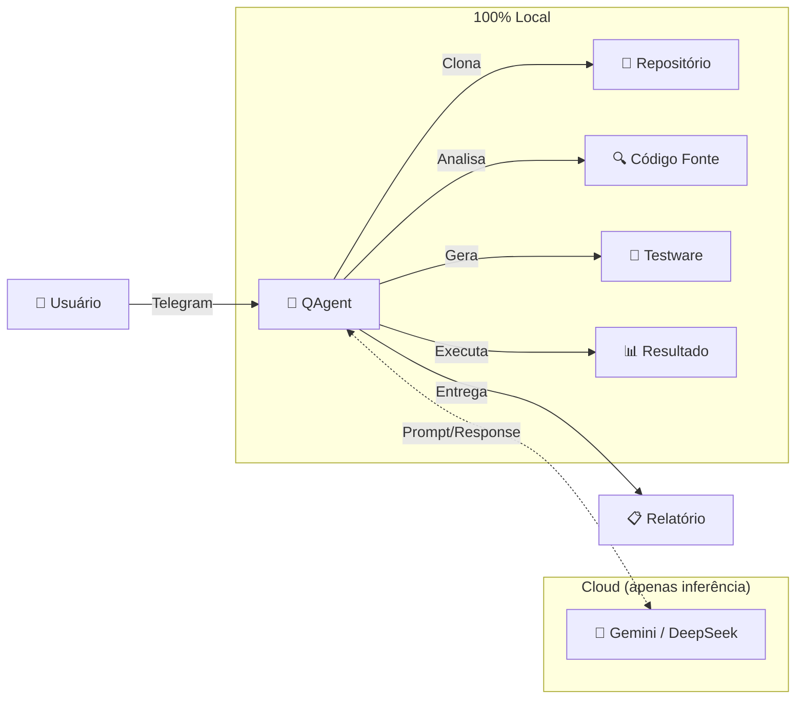
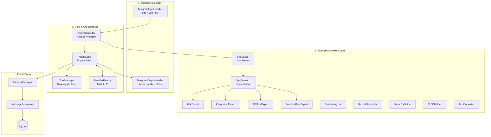
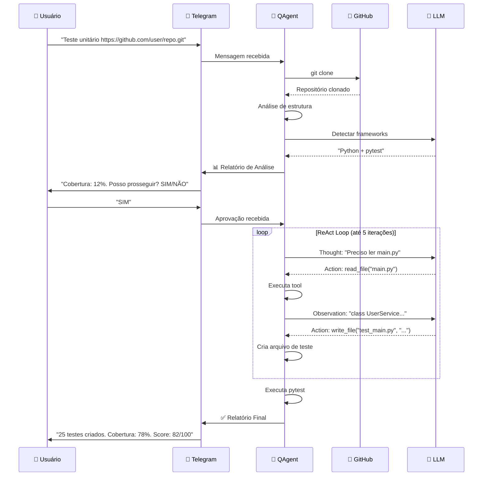
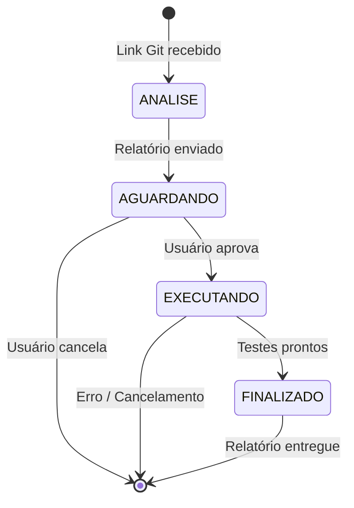

# 📘 QAgent — Documentação Completa do Projeto

> **Versão:** 2.0 | **Última atualização:** Março 2026  
> **Autora:** Aline Assunção  
> **Licença:** MIT

---

## Índice

1. [Visão de Negócio](#-1-visão-de-negócio)
2. [Por Que o QAgent é Disruptivo](#-2-por-que-o-qagent-é-disruptivo)
3. [Arquitetura do Sistema](#-3-arquitetura-do-sistema)
4. [Ecossistema de Skills](#-4-ecossistema-de-skills)
5. [Ferramentas (Tools)](#-5-ferramentas-tools)
6. [Fluxo de Operação](#-6-fluxo-de-operação)
7. [Stack Tecnológica](#-7-stack-tecnológica)
8. [Guia de Setup para Novos Membros](#-8-guia-de-setup-para-novos-membros)
9. [Estrutura de Diretórios](#-9-estrutura-de-diretórios)
10. [Guia de Contribuição](#-10-guia-de-contribuição)
11. [Roadmap e Visão de Futuro](#-11-roadmap-e-visão-de-futuro)
12. [FAQ](#-12-faq)

---

## 🎯 1. Visão de Negócio

### O Problema

A qualidade de software continua sendo um dos maiores gargalos da indústria de tecnologia:

- **70%** dos projetos de software possuem cobertura de testes abaixo de 40%.
- Equipes dedicam em média **30% do tempo corrigindo bugs** que poderiam ser capturados com testes adequados.
- Ferramentas de teste existentes exigem **expertise técnica profunda** e configuração extensa.
- Soluções cloud-based obrigam as empresas a **expor código proprietário** para análise, gerando riscos de compliance e propriedade intelectual.
- QAs e desenvolvedores perdem horas configurando frameworks, escrevendo boilerplate e mantendo pipelines de CI.

### A Solução: QAgent

O **QAgent** é um **Agente de IA Autônomo** que orquestra todo o ciclo de qualidade de software — da análise de código à geração de testes, passando por relatórios profissionais e integração com CI/CD — tudo operando **100% localmente** no ambiente do desenvolvedor.

### Proposta de Valor

```
┌────────────────────────────────────────────────────────────┐
│                                                            │
│   "Cole um link Git no Telegram. Receba testes prontos."   │
│                                                            │
│   📱 Link .git  →  🤖 QAgent  →  ✅ Testes Prontos         │
│                                                            │
└────────────────────────────────────────────────────────────┘
```

**Em uma frase:** O QAgent é o **copiloto de QA** que transforma repositórios sem testes em projetos validados, testados e documentados — via uma mensagem no Telegram.

### Público-Alvo

| Persona | Dor Principal | Como o QAgent Resolve |
|---------|--------------|----------------------|
| **QA Engineer** | Escrever testes manuais repetitivos | Automação inteligente de testware |
| **Desenvolvedor** | Não sabe escrever bons testes | Skills com padrões ISTQB, AAA, FIRST |
| **Tech Lead** | Baixa cobertura no projeto | Relatórios de cobertura e planos de ação |
| **PO / Stakeholder** | Sem visibilidade de qualidade | Relatórios executivos e KPIs visuais |
| **Dev Indie** | Sem equipe de QA | QAgent É a equipe de QA |

### Modelo de Operação



---

## 🚀 2. Por Que o QAgent é Disruptivo

### Comparação com Alternativas de Mercado

| Critério | **QAgent** | GitHub Copilot | SonarQube | Codacy | Snyk |
|----------|-----------|---------------|-----------|--------|------|
| **Execução** | 🟢 100% Local | ❌ Cloud | 🟡 Híbrido | ❌ Cloud | ❌ Cloud |
| **Privacidade** | 🟢 Código nunca sai da máquina | ❌ Enviado para Microsoft | 🟡 Self-host possível | ❌ Cloud obrigatório | ❌ Cloud obrigatório |
| **Gera testes** | 🟢 Automaticamente | 🟡 Sugestões inline | ❌ Não gera | ❌ Não gera | ❌ Não gera |
| **Executa testes** | 🟢 Roda e valida | ❌ Não executa | ❌ Não executa | ❌ Não executa | ❌ Não executa |
| **Análise Estática** | 🟢 Integrada | ❌ Não faz | 🟢 Principal função | 🟢 Principal função | 🟡 Foco em segurança |
| **CI/CD Pipeline** | 🟢 Gera pipelines | ❌ Não gera | ❌ Não gera | ❌ Não gera | ❌ Não gera |
| **Interface** | 🟢 Telegram (móvel!) | IDE only | Web dashboard | Web dashboard | Web dashboard |
| **Custo** | 🟢 Open source + API keys | $$ Subscription | $$$ Enterprise | $$ Subscription | $$ Subscription |
| **Raciocínio** | 🟢 ReAct (pensa→age→observa) | 🟡 Autocomplete | ❌ Regras fixas | ❌ Regras fixas | ❌ Regras fixas |
| **Multi-linguagem** | 🟢 Python, JS, Java, Go, Rust, C# | 🟢 Multi | 🟢 Multi | 🟢 Multi | 🟡 Limitado |

### 5 Diferenças Fundamentais

#### 1. 🔒 Privacidade por Design
Nenhum concorrente oferece análise de código **completamente local**. O código-fonte nunca sai da máquina do usuário. Os LLMs recebem apenas prompts de contexto (trechos de código), nunca repositórios inteiros. Isso é um deal-breaker para empresas em setores regulados (financeiro, saúde, governo).

#### 2. 🧠 Agente Autônomo vs. Ferramenta Passiva
O QAgent não é uma ferramenta que "espera comandos". Ele é um **agente que pensa**:

```
Copilot:    Usuário digita → IA sugere código → Usuário aceita/rejeita
SonarQube:  Code push → Regras estáticas → Lista de problemas
─────────────────────────────────────────────────────────────
QAgent:     Usuário envia link → IA analisa → IA planeja → 
            Usuário aprova → IA implementa → IA executa → 
            IA valida → IA reporta
```

O loop **Thought → Action → Observation** (ReAct) permite que o QAgent tome decisões, corrija erros e adapte sua estratégia em tempo real.

#### 3. 📱 Acessibilidade via Telegram
Nenhum concorrente oferece QA via **mobile**. Um Tech Lead pode revisar um relatório de cobertura no ônibus. Um dev pode pedir testes para um commit do celular. A barreira de entrada é zero: não precisa instalar IDE, plugin, ou abrir dashboard web.

#### 4. 🧩 Arquitetura de Skills Extensível
Skills são arquivos Markdown que podem ser criados, editados e compartilhados sem alterar uma única linha de código. Isso significa:
- **Zero recompilação** para adicionar novas capacidades.
- **Comunidade pode contribuir** criando skills para domínios específicos (IoT testing, mobile testing, etc.).
- **Personalização por empresa**: cada equipe pode ter skills customizadas para seus padrões de teste.

#### 5. 💰 Custo Radicalmente Menor
| Cenário | SonarQube Enterprise | Copilot Business | **QAgent** |
|---------|---------------------|-------------------|-----------|
| Equipe de 10 devs | ~$15.000/ano | ~$2.280/ano | ~$120/ano (API keys) |
| Setup | Semanas | Dias | Minutos |
| Manutenção | Time dedicado | Nenhuma | Nenhuma |

---

## 🏗️ 3. Arquitetura do Sistema

### Diagrama de Alto Nível



### Padrões de Design Utilizados

| Padrão | Onde | Por quê |
|--------|------|---------|
| **Facade** | `AgentController` | Simplifica acesso aos subsistemas |
| **Factory** | `ProviderFactory` | Instanciação dinâmica de LLMs |
| **Repository** | `MessageRepository` | Abstração sobre SQLite |
| **Strategy** | `OutputHandler` | Escolha entre texto, voz e arquivos |
| **Plugin** | `SkillLoader` | Skills como plugins hot-reloadable |
| **Chain of Responsibility** | `AgentLoop` | Iterações ReAct encadeadas |
| **Observer** | `aiogram` nativo | Handlers de eventos Telegram |

### Fluxo de Dados

```
📱 Mensagem Telegram
    │
    ▼
┌─ TelegramInputHandler ─┐
│  • Texto direto         │
│  • Áudio → Whisper STT  │
│  • PDF → PyMuPDF parse  │
└────────┬────────────────┘
         │ user_input: str
         ▼
┌─ AgentController ───────┐
│  1. Rate Limiter         │
│  2. Cancelamento?        │
│  3. Detectar tipo teste  │
│  4. Extrair link .git    │
│  5. Clonar repositório   │
│  6. Analisar estrutura   │
│  7. Gerar relatório      │
│  8. Aguardar aprovação   │
└────────┬────────────────┘
         │ aprovação: "SIM"
         ▼
┌─ AgentLoop (ReAct) ─────┐
│  ┌─ Thought ──────────┐  │
│  │ "Preciso ler o      │  │
│  │  código fonte..."   │  │
│  └────────┬───────────┘  │
│           ▼              │
│  ┌─ Action ────────────┐ │
│  │ read_file("main.py")│ │
│  └────────┬───────────┘  │
│           ▼              │
│  ┌─ Observation ───────┐ │
│  │ "class UserService..."│ │
│  └────────┬───────────┘  │
│           ▼ (repete até) │
│  ┌─ FINAL_ANSWER ──────┐ │
│  │ Testes gerados ✅    │ │
│  └──────────────────────┘ │
└────────┬────────────────┘
         │
         ▼
┌─ TelegramOutputHandler ─┐
│  • Mensagem Markdown     │
│  • Áudio Edge-TTS        │
│  • Documento .md / .py   │
└──────────────────────────┘
```

---

## 🎯 4. Ecossistema de Skills

### O Que São Skills?

Skills são **plugins baseados em Markdown** que adicionam capacidades especializadas ao QAgent sem alterar código. Cada skill é uma pasta com um `SKILL.md` que contém:

- **Frontmatter YAML**: Metadados (`name`, `description`) usados para roteamento.
- **Instruções Markdown**: Guias detalhados que o LLM segue durante execução.
- **Referências** (opcional): Documentos complementares em `references/`.

### Como Funciona o Hot-Reload

```
1. Usuário envia mensagem
2. SkillLoader varre agents/skills/ no disco
3. SkillRouter analisa a mensagem e decide qual skill ativar
4. O conteúdo do SKILL.md é injetado no System Prompt do ReAct Loop
5. O LLM assume a "persona" e ferramentas daquela skill
```

**Resultado**: basta editar um `.md` e o comportamento do QAgent muda instantaneamente, sem restart.

### Mapa Completo de Skills

```
agents/skills/
│
├── 🎼 QA_Maestro/                    ← ORQUESTRADOR CENTRAL
│   ├── SKILL.md
│   └── subskills/
│       ├── 🧪 UnitExpert/            ← Testes Unitários (ISTQB)
│       │   ├── SKILL.md
│       │   └── references/
│       │       ├── framework_mapping.md
│       │       └── istqb_glossary.md
│       │
│       ├── 🔗 IntegrationExpert/     ← Testes de Integração
│       │   ├── SKILL.md
│       │   └── references/
│       │       ├── integration_patterns.md
│       │       └── database_testing.md
│       │
│       ├── 🌐 APITestExpert/         ← Testes de API REST/GraphQL
│       │   ├── SKILL.md
│       │   └── references/
│       │       └── http_status_guide.md
│       │
│       └── 🖥️ FrontendTestExpert/    ← Testes de Componente e E2E
│           └── SKILL.md
│
├── 🔬 StaticAnalyzer/                ← Análise de Código e Qualidade
│   ├── SKILL.md
│   └── references/
│       ├── metrics_guide.md
│       └── smell_catalog.md
│
├── 📊 ReportGenerator/               ← Relatórios Profissionais
│   ├── SKILL.md
│   └── references/
│       └── report_templates.md
│
├── 🔧 RefactorGuide/                 ← Refatoração para Testabilidade
│   ├── SKILL.md
│   └── references/
│       └── refactoring_catalog.md
│
├── ⚙️ CICDHelper/                    ← Pipelines de CI/CD
│   └── SKILL.md
│
└── 📝 TestDocWriter/                  ← Documentação de Testes
    └── SKILL.md
```

### Resumo de Cada Skill

| Skill | O Que Faz | Gatilho (Exemplos) |
|-------|-----------|-------------------|
| **QA_Maestro** | Coordena o fluxo completo, delega para sub-skills | Qualquer pedido de teste + repositório |
| **UnitExpert** | Cria testes unitários com padrão AAA/FIRST, cobertura de decisão | "teste unitário", "testar funções" |
| **IntegrationExpert** | Testa interação entre módulos, DB, serviços | "teste de integração", "testar banco" |
| **APITestExpert** | Testa endpoints REST/GraphQL (happy path, auth, erros) | "testar API", "testar endpoints" |
| **FrontendTestExpert** | Testa componentes React/Vue/Angular + E2E Playwright | "testar frontend", "testar componente" |
| **StaticAnalyzer** | Avalia qualidade, complexidade, code smells, testabilidade | "analisar código", "qualidade" |
| **ReportGenerator** | Relatórios de progresso, final com gráficos, executivo | "relatório", "dashboard", "métricas" |
| **RefactorGuide** | Identifica barreiras de design e propõe refatorações | "refatorar", "testabilidade" |
| **CICDHelper** | Gera pipelines GitHub Actions / GitLab CI / Azure | "pipeline", "CI/CD" |
| **TestDocWriter** | Planos de teste (IEEE 829), BDD, matrizes de rastreabilidade | "documentar testes", "plano de teste" |

---

## 🔨 5. Ferramentas (Tools)

Tools são as **mãos do agente** — classes Python que executam ações no sistema.

| Tool | Classe | Ação |
|------|--------|------|
| `clone_repository` | `CloneRepositoryTool` | Clona repositórios Git para `projects/` |
| `list_directory` | `ListDirectoryTool` | Lista arquivos e pastas |
| `read_file` | `ReadFileTool` | Lê conteúdo de arquivos (limite 10k chars) |
| `write_file` | `WriteFileTool` | Cria/escreve arquivos |
| `git_manage` | `GitManagementTool` | Commit, push, run_tests, detect_tests |
| `activate_skill` | `SkillActivationTool` | Carrega instruções de uma skill |
| `run_shell` | `RunShellTool` | Executa comandos com whitelist de segurança |

### Segurança da RunShellTool

A tool de execução de shell implementa **3 camadas de proteção**:

```
Camada 1: WHITELIST DE COMANDOS
  └─ ~25 comandos permitidos (pytest, ruff, npm, etc.)
  └─ Tudo fora da lista é BLOQUEADO

Camada 2: PADRÕES PROIBIDOS (Regex)
  └─ Operadores de shell: ; & | ` $
  └─ Path traversal: ../../..
  └─ Injeção: curl|sh, eval, exec, powershell

Camada 3: SANITIZAÇÃO DE AMBIENTE
  └─ Tokens e API keys são REMOVIDOS do env do subprocesso
  └─ Subcomandos Git limitados (sem push force, reset --hard)
```

### Criando uma Nova Tool

Todas as tools herdam de `BaseTool`:

```python
from core.tools.base import BaseTool

class MinhaNovaToolTool(BaseTool):
    @property
    def name(self) -> str:
        return "minha_tool"         # nome usado pelo LLM

    @property
    def description(self) -> str:
        return "Descrição do que faz"  # o LLM lê isso para decidir quando usar

    @property
    def parameters(self) -> dict:
        return {                    # schema OpenAI-style
            "type": "object",
            "properties": {
                "param1": {"type": "string", "description": "..."}
            },
            "required": ["param1"]
        }

    async def execute(self, param1: str, **kwargs) -> str:
        # Lógica da tool
        return "Resultado como string"
```

Depois, registre no `controller.py` dentro da lista de `tools` do `_implementar_testes`.

---

## 🔄 6. Fluxo de Operação

### Jornada Completa do Usuário



### Estados do Fluxo



---

## 🛠️ 7. Stack Tecnológica

| Camada | Tecnologia | Versão | Justificativa |
|--------|-----------|--------|---------------|
| **Linguagem** | Python | 3.11+ | Ecossistema maduro para IA e QA |
| **Bot Framework** | aiogram | 3.4+ | Assíncrono, moderno, tipado |
| **IA - Primário** | Google Gemini | SDK v1+ | Performance, custo-benefício |
| **IA - Fallback** | DeepSeek | API | Redundância de provedor |
| **IA - Local** | LM Studio | Compatível OpenAI | Privacidade total (offline) |
| **Banco de Dados** | SQLite | Built-in | Zero config, portátil |
| **STT** | Faster-Whisper | 1.0 | Transcrição de voz local |
| **TTS** | Edge-TTS | 6.1 | Síntese de voz em português |
| **PDF Parser** | PyMuPDF | 1.25 | Leitura rápida de documentos |
| **Config** | pydantic-settings | 2.1 | Validação tipada de .env |

### Hierarquia de Provedores (Fallback)

```
1. 🖥️ LM Studio (Local)     ← Prioridade máxima (privacidade)
2. 🌐 Google Gemini (Cloud)  ← Fallback principal
3. 🌐 DeepSeek (Cloud)       ← Fallback secundário
4. 🌐 OpenAI (Cloud)         ← Último recurso
```

Se o LM Studio estiver rodando localmente com modelo carregado, o QAgent usa exclusivamente IA local. Caso contrário, faz fallback automático para APIs cloud.

---

## ⚡ 8. Guia de Setup para Novos Membros

### Pré-requisitos

- [x] Python 3.11 ou superior
- [x] Git instalado
- [x] Conta no Telegram
- [x] Pelo menos uma API key (Gemini recomendado) OU LM Studio instalado

### Passo a Passo

```powershell
# 1. Clone o repositório
git clone https://github.com/seu-org/QAgent.git
cd QAgent

# 2. Crie o ambiente virtual
python -m venv .venv
.\.venv\Scripts\Activate.ps1    # Windows
# source .venv/bin/activate      # Linux/Mac

# 3. Instale as dependências
pip install -r requirements.txt

# 4. Configure o ambiente
cp .env.example .env
# Edite .env com suas chaves (veja seção abaixo)

# 5. Execute o bot
python main.py
```

### Configuração do `.env`

```bash
# OBRIGATÓRIO: Token do bot Telegram
# Crie via @BotFather no Telegram
TELEGRAM_BOT_TOKEN=123456:ABC-DEF...

# OBRIGATÓRIO: Seu ID do Telegram
# Obtenha via @userinfobot no Telegram
TELEGRAM_ALLOWED_USER_IDS=123456789

# IA: Pelo menos um provedor necessário
GEMINI_API_KEY=sua_chave_gemini          # https://aistudio.google.com
DEEPSEEK_API_KEY=sua_chave_deepseek      # https://platform.deepseek.com
OPENAI_API_KEY=sua_chave_openai          # https://platform.openai.com

# IA Local (opcional)
LM_STUDIO_BASE_URL=http://localhost:1234/v1
LM_STUDIO_MODELS=seu-modelo-local

# Ajustes (opcionais)
MAX_ITERATIONS=5            # Máximo de iterações do ReAct loop
MEMORY_WINDOW_SIZE=10       # Mensagens mantidas no contexto
LOG_LEVEL=INFO              # DEBUG para mais detalhes
```

### Verificação

Após iniciar o bot, envie no chat do Telegram:

```
Teste unitário https://github.com/exemplo/repo-simples.git
```

Se tudo estiver correto, o QAgent responderá com a análise do repositório.

---

## 📁 9. Estrutura de Diretórios

```
QAgent/
├── 📄 main.py                  ← Ponto de entrada
├── 📄 requirements.txt         ← Dependências Python
├── 📄 .env.example             ← Template de configuração
├── 📄 run.ps1                  ← Script de execução (Windows)
├── 📄 README.md                ← Visão geral rápida
├── 📄 DOCUMENTATION.md         ← Este documento ★
│
├── 📂 core/                    ← Núcleo do sistema
│   ├── bot.py                  ← Instância do bot aiogram
│   ├── config.py               ← Settings (pydantic-settings)
│   ├── controller.py           ← Facade principal + fluxo de QA
│   ├── loop.py                 ← Engine ReAct (Thought→Action→Observation)
│   ├── provider.py             ← Multi-LLM (Gemini, DeepSeek, LM Studio)
│   ├── middleware.py           ← Rate limiter, health checks
│   └── tools/                  ← Ferramentas do agente
│       ├── base.py             ← Classe abstrata BaseTool
│       ├── manager.py          ← Registry e dispatcher de tools
│       ├── git.py              ← Clone de repositórios
│       ├── git_management.py   ← Commit, push, detect_tests, run_tests
│       ├── repository.py       ← list_directory, read_file, write_file
│       ├── shell.py            ← Execução de comandos (com whitelist)
│       └── skills.py           ← Ativação dinâmica de skills
│
├── 📂 handlers/                ← I/O do Telegram
│   ├── input.py                ← Processa texto, voz (Whisper) e PDF
│   └── output.py               ← Envia texto, áudio (TTS) e documentos
│
├── 📂 memory/                  ← Persistência
│   ├── database.py             ← Singleton SQLite (WAL mode)
│   └── repository.py           ← CRUD de conversas e mensagens
│
├── 📂 agents/skills/           ← Skills do agente (Markdown plugins)
│   ├── QA_Maestro/             ← Orquestrador + 4 sub-skills
│   ├── StaticAnalyzer/         ← Análise estática
│   ├── ReportGenerator/        ← Relatórios profissionais
│   ├── RefactorGuide/          ← Guia de refatoração
│   ├── CICDHelper/             ← Geração de pipelines
│   └── TestDocWriter/          ← Documentação de testes
│
├── 📂 skills/                  ← Módulo Python do SkillLoader
│   └── loader.py               ← Parse de YAML frontmatter
│
├── 📂 specs/                   ← Especificações técnicas (PRD-style)
│   ├── PRD.md                  ← Product Requirements
│   ├── architecture.md         ← Arquitetura e componentes
│   ├── agent-loop.md           ← Especificação do ReAct loop
│   ├── memory.md               ← Especificação do módulo de memória
│   ├── skill-user.md           ← Especificação do sistema de skills
│   ├── skill-*.md              ← Specs de cada skill (10 arquivos)
│   └── tool-shell.md           ← Spec da RunShellTool
│
├── 📂 tests/                   ← Testes do próprio QAgent
│   ├── test_git_clone.py
│   ├── test_middleware.py
│   ├── test_react_loop.py
│   └── test_tools.py
│
├── 📂 projects/                ← Repositórios clonados (gitignored)
├── 📂 data/                    ← Banco SQLite (gitignored)
└── 📂 tmp/                     ← Arquivos temporários (gitignored)
```

---

## 🤝 10. Guia de Contribuição

### Como Criar uma Nova Skill

A forma mais simples de contribuir é **criando novas skills**. Não requer alteração de código Python:

1. **Crie uma pasta** em `agents/skills/SuaSkill/`
2. **Crie o `SKILL.md`** com frontmatter YAML:
   ```yaml
   ---
   name: SuaSkill
   description: Quando usar esta skill. Seja "pushy" — liste
     todas as situações onde ela seria útil.
   ---
   ```
3. **Escreva as instruções** em Markdown: fluxo de trabalho, templates, restrições
4. **Adicione referências** (opcional): `references/guia.md`
5. **Crie a spec**: `specs/skill-sua-skill.md`
6. **Teste**: envie uma mensagem no Telegram que deveria ativar sua skill

### Como Criar uma Nova Tool

1. Crie a classe em `core/tools/sua_tool.py` herdando `BaseTool`
2. Registre no `controller.py` na lista de `tools`
3. Crie a spec em `specs/tool-sua-tool.md`
4. Adicione testes em `tests/test_sua_tool.py`

### Convenções

| Aspecto | Convenção |
|---------|-----------|
| **Idioma do código** | Python: inglês (nomes de classes/métodos) |
| **Idioma da documentação** | Português (BR) |
| **Idioma dos prompts/skills** | Português (BR) |
| **Commit messages** | Português, imperativo ("Adiciona skill X") |
| **Branch naming** | `feature/nome-da-skill`, `fix/descricao-do-bug` |
| **Formatação Python** | ruff (configuração padrão) |
| **Type hints** | Obrigatórios em funções públicas |
| **Async** | Todas as tools e handlers devem ser async |

### Fluxo de Pull Request

```
1. Crie branch: feature/minha-skill
2. Implemente skill + spec + testes
3. Rode: pytest tests/
4. Rode: ruff check .
5. Abra PR com descrição detalhada
6. Code review por pelo menos 1 membro
7. Merge para develop → main
```

---

## 🔮 11. Roadmap e Visão de Futuro

### Curto Prazo (Q2 2026)
- [ ] Testes end-to-end do próprio QAgent
- [ ] Integração da RunShellTool no pipeline principal
- [ ] Persistência de histórico de testes (`data/test_history.json`)
- [ ] Relatórios com gráficos de tendência ao longo do tempo

### Médio Prazo (Q3-Q4 2026)
- [ ] **Multi-usuário**: suporte a equipes (cada usuário com seus projetos)
- [ ] **Webhooks Git**: acionar testes automaticamente a cada push (sem Telegram)
- [ ] **Dashboard Web** (opcional): visualização avançada de métricas
- [ ] **Skill Marketplace**: repositório de skills da comunidade
- [ ] **Testes de Performance**: skill para load testing (k6, locust)
- [ ] **Testes de Segurança**: skill para SAST/DAST automatizado

### Longo Prazo (2027+)
- [ ] **Multi-repositório**: monitorar N projetos simultaneamente
- [ ] **Learning loop**: QAgent aprende com feedback do usuário quais testes são bons
- [ ] **Integração com Jira/GitHub Issues**: criar issues para bugs encontrados
- [ ] **Agente em equipe**: múltiplos QAgents colaborando (Code Reviewer + Tester + DevOps)

### Visão

> O QAgent não é apenas uma ferramenta de QA — é o começo de uma nova categoria: **Agentes de IA Autônomos para Engenharia de Software**. Enquanto o mercado oferece ferramentas passivas que analisam e sugerem, o QAgent **age**: clona, analisa, planeja, implementa, executa, valida e reporta. Essa autonomia, combinada com privacidade local e interface acessível, tem potencial para democratizar o acesso à qualidade de software — uma capacidade que hoje é privilégio de equipes grandes ou empresas que podem pagar por ferramentas enterprise.

---

## ❓ 12. FAQ

### Perguntas Técnicas

**P: O código-fonte do meu projeto é enviado para a nuvem?**
R: Não. O código-fonte permanece 100% no seu computador. Os LLMs (Gemini, DeepSeek) recebem apenas trechos de código no contexto dos prompts, nunca repositórios inteiros. Para privacidade total, use LM Studio com modelo local.

**P: Posso usar o QAgent offline?**
R: Sim, se você tiver o LM Studio rodando com um modelo carregado. A parte de Telegram exige internet, mas toda a análise de código e geração de testes roda localmente.

**P: Quais linguagens de programação são suportadas?**
R: Python, JavaScript/TypeScript, Java, C#, Go, Rust. A detecção é automática via arquivos de configuração (`requirements.txt`, `package.json`, `pom.xml`, etc.).

**P: O que acontece se o LLM gerar testes ruins?**
R: O fluxo é sempre com aprovação humana. O QAgent apresenta um plano de testes ANTES de implementar. Se os testes gerados não passarem, o loop ReAct tenta corrigir automaticamente.

**P: Posso customizar o comportamento?**
R: Sim. Edite qualquer `SKILL.md` e o comportamento muda instantaneamente (hot-reload). Você também pode criar novas skills para domínios específicos.

### Perguntas de Negócio

**P: Quanto custa rodar o QAgent?**
R: O QAgent é open-source. O único custo é a API key do LLM. Com Gemini, o custo por análise de repositório é de centavos. Com LM Studio local, o custo é zero.

**P: Como o QAgent se compara ao GitHub Copilot?**
R: O Copilot sugere código inline enquanto você digita. O QAgent analisa repositórios inteiros, gera suítes de teste completas, executa os testes e produz relatórios. São complementares: o Copilot ajuda a escrever código, o QAgent garante que funciona.

**P: Posso usar em projetos da empresa?**
R: Sim. O código nunca sai do seu computador. Para compliance total, use com LM Studio (IA 100% local). Consulte o departamento jurídico sobre o uso de APIs de IA com trechos de código proprietário.

---

> **📌 Para dúvidas não cobertas aqui, consulte a pasta `specs/` ou abra uma issue no repositório.**
