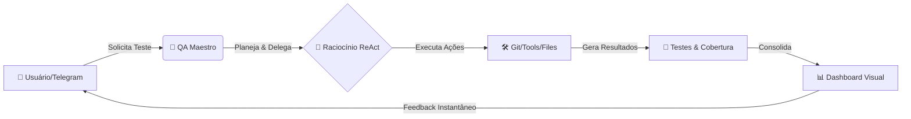
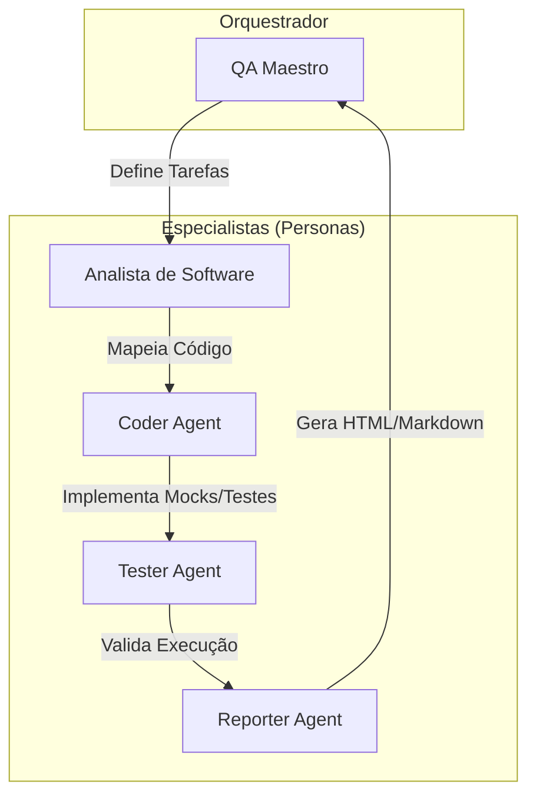
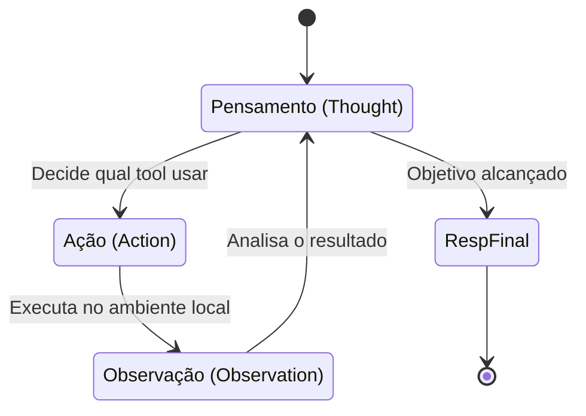
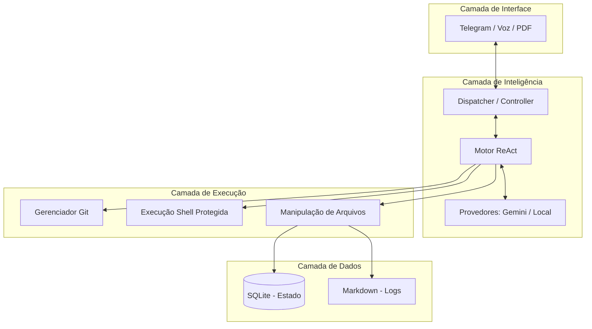

# 🎨 Galeria de Diagramas: QAgent

Esta galeria consolida as visões visuais do projeto, prontas para serem utilizadas em apresentações acadêmicas e documentação técnica.

---

## 1. Visão Conceitual 3D (Slide de Abertura/Solução)

Uma representação artística de alto impacto da "Banca de Especialistas" do QAgent.

---

## 2. Visão de Fluxo de Negócio (Nível Executivo)

Demonstra o valor entregue ao usuário final de forma simples.

---

## 3. Arquitetura Multi-Agente (Nível Técnico)

Detalha a separação de responsabilidades entre os agentes especialistas.

---

## 4. O Coração do Agente: Ciclo ReAct

O processo iterativo que cada agente segue para garantir o determinismo e evitar alucinações.

---

## 5. Diagrama de Contexto e Camadas

Visão de sistema completa, do Telegram ao Banco de Dados.

