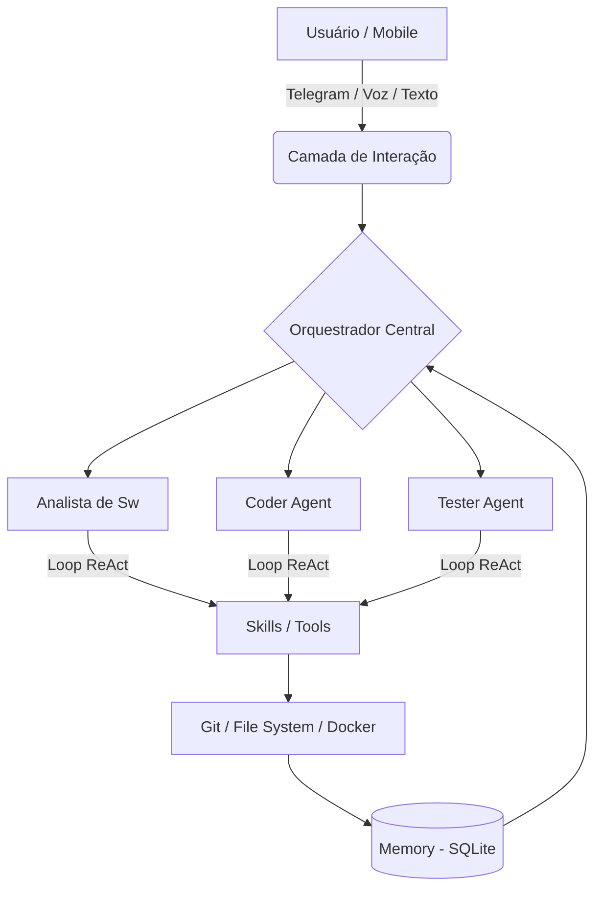

# Arquitetura QAgent: Agentes Inteligentes e Engine ReAct

Esta sessão detalha a infraestrutura lógica do QAgent, essencial para a compreensão técnica em um nível de pós-graduação.

---

## 1. Visão Macro da Arquitetura

O QAgent segue uma arquitetura em camadas, separando a **Precepção (Entrada)**, a **Cognição (Orquestração)** e a **Ação (Execução)**.

---

## 2. O Loop de Raciocínio (ReAct Engine)

O QAgent utiliza o framework **Reasoning and Acting (ReAct)** para gerenciar a incerteza e a complexidade. Ao contrário de modelos sequenciais, o ReAct permite que o agente corrija sua própria rota.

- **Thought (O Cérebro)**: O Agente analisa o histórico e o desafio atual. Ele gera uma string de raciocínio explicando o "porquê" da próxima ação.
- **Action (As Mãos)**: O Agente escolhe uma ferramenta do `ToolManager`. Ele gera um JSON de parâmetros (Action Input).
- **Observation (Os Olhos)**: O sistema executa a ferramenta de forma isolada e retorna o resultado (logs, arquivos, erros) para o contexto do agente.
- **Tratamento de Alucinação**: O loop possui mecanismos para detectar e truncar quando o modelo tenta "inventar" uma observação que não aconteceu, forçando o determinismo.

---

## 3. Topologia Multi-Agente e Fluxo de Chamadas

O sistema opera sob uma hierarquia de comando liderada pelo **QA Maestro**.

### O Time de Especialistas:
| Agente | Função Técnica | Detalhe de Implementação |
| :--- | :--- | :--- |
| **QA Maestro** | Orquestrador e Router | Decompõe o objetivo (ex: "Testar Repo X") em tarefas atômicas e coordena a ordem de chamada dos outros especialistas. |
| **Analista** | Compreensão de Domínio | Analisa o código fonte clonado e define quais arquivos são críticos para a lógica de negócio. |
| **Coder** | Implementador | Atua na manipulação física de arquivos (`write_file`) para implementar mocks, correções ou lógica de suporte. |
| **Tester** | Especialista em QA | Especializado em frameworks (Pytest, Jest). Garante que a suíte de testes seja válida e executável. |
| **Reporter** | Data Viz & Analytics | Transforma os logs de execução bruta no Dashboard Visual e no relatório de checkpoint Markdown. |

---

## 4. Gestão de Código e Provedores (Resiliência)

### A. Autonomia vía Git (Remote Independence)
O QAgent é independente do ambiente local. Através da ferramenta `git_management`, ele:
1.  Faz o download (clone) de qualquer repositório via HTTPS.
2.  Isola o código na pasta `/projects` dentro do diretório do agente.
3.  Permite realizar auditorias e testes em repositórios remotos sem que o usuário precise ter o código baixado em sua própria máquina.

### B. Estratégia de Provedores e Fallback de Custo
O projeto foi desenhado sob a premissa de **viabilidade econômica** (Low Cost / No Cost):
-   **Provedor Primário (Gemini Flash)**: Utilizado por sua alta cota gratuita e velocidade de resposta.
-   **Lógica de Fallback Automático**: Caso o provedor primário retorne um erro `429 (Rate Limit)` ou `503 (Unavailable)`, o `AgentLoop` intercepta o erro e:
    -   Marca o provedor como "Unhealthy".
    -   Consulta o mapa de provedores disponíveis (OpenRouter, DeepSeek ou Local).
    -   Troca o provedor "on-the-fly" e continua a iteração exatamente de onde parou.
-   **IA Soberana (Local)**: Suporte a modelos locais (via Ollama/LLM Studio) para quando a conexão externa falha ou por motivos de privacidade.

---

## 5. Seleção Dinâmica de Modelos (Smart Routing)

O QAgent não depende de um único LLM. Ele roteia tarefas baseado em complexidade e custo:
-   **Raciocínio Complexo**: Gemini 1.5 Pro ou GPT-4o.
-   **Execução Rápida / Verificação**: Gemini Flash ou DeepSeek.
-   **Tarefas Privadas**: Modelos locais (Llama-3 via Ollama ou LM Studio).
