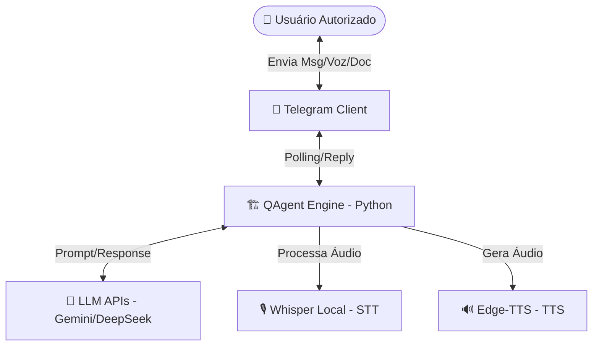
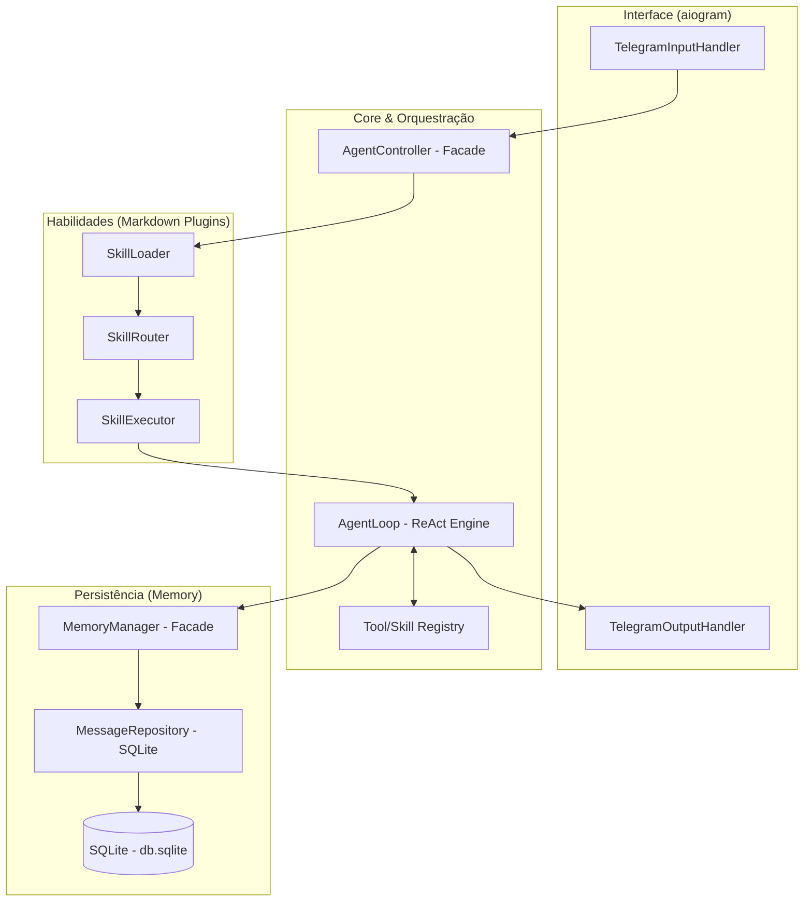

# Arquitetura do Projeto: QAgent

**Versão:** 1.2 (Python Migration)
**Status:** Definição Central de Arquitetura
**Autor:** Aline Assunção
**Data:** 2026-03-28

---

## 2.1 Visão Geral

O **QAgent** é um agente de Inteligência Artificial projetado para operar localmente, focado na orquestração de testes automatizados e assistência técnica. Sua interface primária é o Telegram, permitindo interação via texto, documentos e voz. O sistema é modular, extensível através de "skills" (habilidades) e focado em privacidade, mantendo todos os dados e execuções no ambiente local do usuário.

A arquitetura utiliza um loop de raciocínio (**ReAct**) implementado em **Python**, que interage com LLMs externos apenas para inferência, enquanto a execução de ferramentas e o acesso ao sistema de arquivos ocorrem localmente.

---

## 2.2 Requisitos Arquiteturais

| Requisito | Tipo | Prioridade | Notas |
|-----------|------|------------|-------|
| Operação Local | Não-funcional | Crítica | O core deve rodar no host local (Windows/Linux). |
| Interface Telegram | Funcional | Alta | Uso da biblioteca **aiogram** para polling assíncrono. |
| Persistência Local | Funcional | Alta | Armazenamento de conversas em **SQLite**. |
| Padronização de LLMs | Não-funcional | Alta | Suporte a Gemini, DeepSeek e modelos locais (Ollama). |
| Multimodalidade | Funcional | Média | Suporte a PDF, Markdown e Voz (Whisper/Edge-TTS). |
| Segurança | Funcional | Crítica | Whitelist estrita baseada em ID de usuário do Telegram. |

---

## 2.3 Estilo Arquitetural

O sistema adota um estilo **Monolito Modular com Sistema de Plugins**.
- **Modularidade**: Separação clara entre Handlers de Interface, Engine de Raciocínio e Gestão de Memória.
- **Sistema de Skills (Plugins)**: Permite adicionar novas capacidades QA/Dev apenas manipulando arquivos Markdown na pasta `agents/skills`, sem reiniciar o agente.

---

## 2.4 Diagrama de Contexto

---

## 2.5 Diagrama de Componentes e Camadas

---

## 2.6 Decisões de Tecnologia (Source of Truth)

| Componente | Tecnologia | Detalhes / Justificativa |
|------------|------------|-------------------------|
| **Linguagem** | **Python 3.11+** | Padrão para IA, QA e Automação. Rico ecossistema de bibliotecas. |
| **Paradigma** | **OOP + AsyncIO** | Uso de Classes e Programação Assíncrona para alta performance no Bot. |
| **Banco de Dados**| **SQLite** | Local e leve. Uso do módulo nativo `sqlite3` ou `SQLAlchemy`. |
| **Interface Bot** | **aiogram** | Framework moderno, assíncrono e baseado em Type Hints para Telegram. |
| **Raciocínio IA** | **ReAct Pattern** | Ciclo Iterativo: Pensamento -> Ação -> Observação -> Resposta. |
| **STT (Voz)** | **Whisper (Local)** | Transcrição privada via `openai-whisper` ou `faster-whisper`. |
| **TTS (Fala)** | **Edge-TTS** | Geração de áudio de alta qualidade via `edge-tts` Python. |
| **Parser Docs** | **PyMuPDF** | Leitura rápida e precisa de arquivos PDF e Markdown. |

---

## 2.7 Design Patterns Utilizados

1.  **Facade**: No `AgentController` para simplificar o acesso aos subsistemas de Skills e IA.
2.  **Factory**: No `ProviderFactory` para instanciar dinamicamente provedores de LLM.
3.  **Repository**: No `MessageRepository` para abstrair as queries SQL.
4.  **Observer/Dispatcher**: Nativo do **aiogram** para lidar com diferentes tipos de eventos do Telegram.
5.  **Strategy**: No `OutputHandler` para escolher entre texto, voz ou arquivos.

---

## 2.8 Infraestrutura e Deploy

- **Ambiente**: Execução local (Windows/Linux/Mac).
- **Gerenciador**: `venv` ou `Poetry` para dependências.
- **Diretórios**:
    - `./data/`: Banco de dados e persistência.
    - `./tmp/`: Arquivos temporários processados.
    - `agents/skills/`: Onde residem as sub-skills (QA_Maestro, UnitExpert, etc.).

---

## 2.9 Riscos e Mitigações

- **Concorrência no SQLite**: Mitigado pelo uso de conexões seguras e modo WAL.
- **Estouro de Contexto**: Gerido pelo `MemoryManager` através de truncamento inteligente.
- **Falha de API**: Implementação de Fallback automático entre provedores (ex: Gemini -> DeepSeek).
